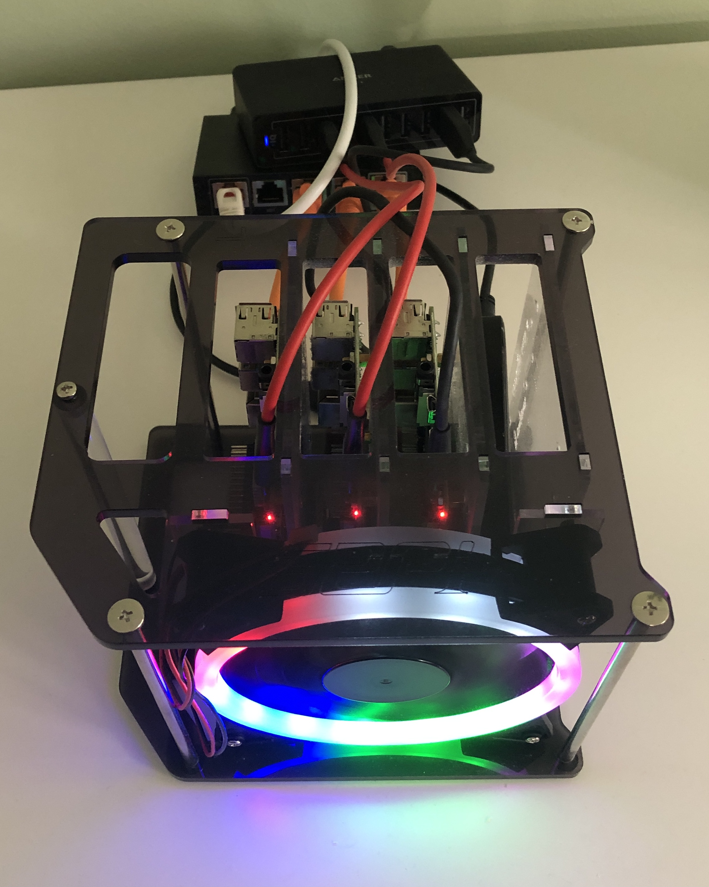

# Flux2 Repo for my Cluster


<p style="text-align: center;">The cluster 🕸</p>

## Seal secrets so that the cluser can use them

```
kubeseal --format=yaml --cert ./kubeseal-cert/pub-sealed-secrets.pem <monitoring/grafana-secret.yaml > grafana-secret-sealed.yaml
```